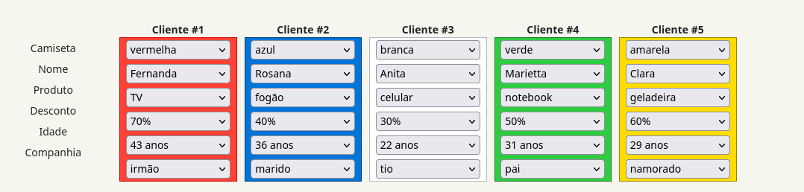

# Executar 
Digite o comando 
```
swipl blackfriday.pl
```
e então 
```
?- solucao(L).
```

# Problema 
O problema está definido em https://rachacuca.com.br/logica/problemas/black-friday/.

A solução obtida pelo programa é a seguinte:
